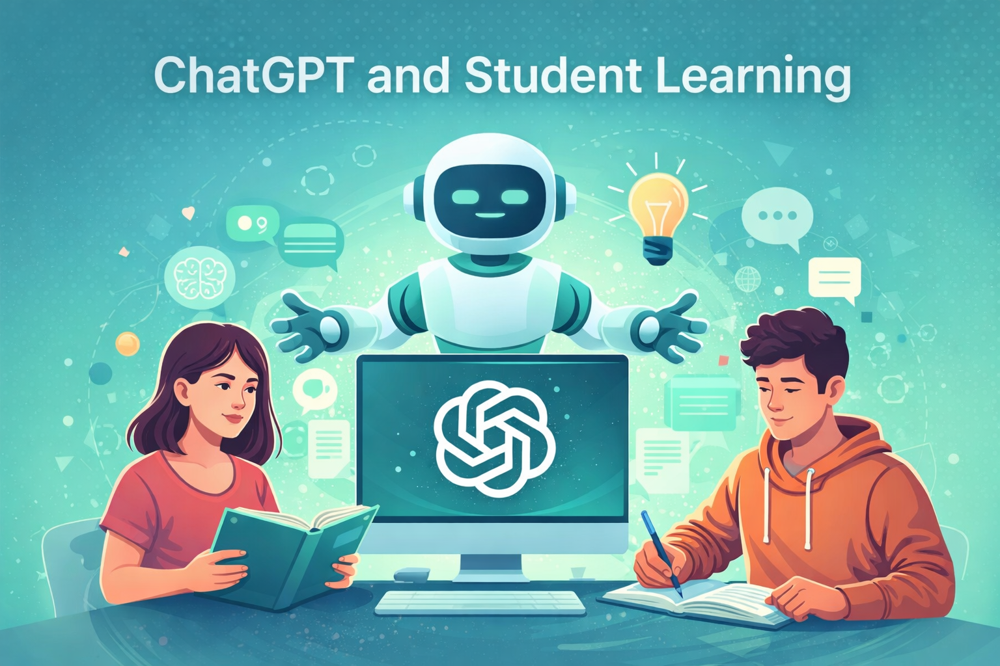

# Does ChatGPT enhance student learning?

---

## Navigation
- [Overview on the Meta Analysis](#overview-on-the-meta-analysis)
- [Introduction](#introduction)
- [Main Results](#main-results)
- [Quality of Studies after MAGIC](#quality-of-studies-after-magic)
- [Stakeholder Perspectives](#stakeholder-perspectives)
- [Study Examples](#individual-study-examples)
- [AI Transparency](#ai-transparency-statement)

---

## Overview on the Meta Analysis

This website presents a structured overview of current research on the impact of ChatGPT on student learning.

The project is based on a meta-analysis examining how generative AI tools influence learning outcomes, motivation and higher-order thinking.

---

## Introduction

---

## Main Results

---

## Quality of Studies after MAGIC

The meta-analysis was evaluated using the MAGIC criteria:

**Magnitude**  

**Articulation**  

**Generality**  

**Interestingness**  

**Credibility**  

---

## Stakeholder Perspectives

---

## Individual Study Examples

---

## AI Transparency Statement

ChatGPT was used to support the structuring of the website, drafting of text and preparation of summaries.  
All content was checked against the original scientific sources.

---

## Authors

University project by  
**Knes Christina & Hofer Marina**  
on ChatGPT and Student Learning